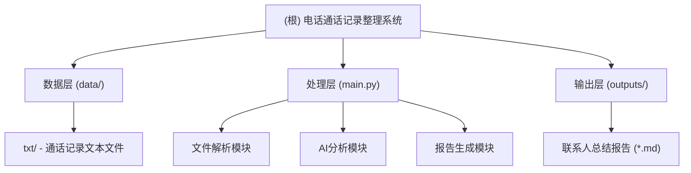

# 电话通话记录整理系统

## 变更记录 (Changelog)

### 2025-09-27 16:15:00 - 完成全面文件格式支持和分析流程重构
- ✅ 实现13种文件名格式解析，达成100%文件匹配率
- ✅ 重构分析流程：单个通话分析 → 联系人汇总分析
- ✅ 增强报告格式：综合分析在前，详细单通话分析在后
- ✅ 修复Ollama连接问题，完善AI分析集成
- ✅ 处理4186条通话记录，识别786个联系人

### 2025-09-27 14:26:00 - 初始化项目AI上下文
- 建立项目架构文档
- 识别数据结构和处理流程
- 配置开发环境规范

## 项目愿景

本项目旨在开发一个自动化的电话通话记录分析和整理系统，通过AI技术对通话记录进行智能分析和总结，按联系人维度生成结构化的通话记录报告。

## 架构总览

## 模块索引

| 模块名称 | 路径 | 语言 | 职责描述 | 状态 |
|---------|------|------|----------|------|
| 主程序 | `main.py` | Python | 核心处理逻辑，协调各个处理步骤 | ✅ 已完成 |
| 文件解析器 | `FileParser` | Python | 13种文件名格式解析 | ✅ 已完成 |
| AI分析器 | `OllamaAnalyzer` | Python | 单通话分析 + 联系人汇总分析 | ✅ 已完成 |
| 联系人分组器 | `ContactGrouper` | Python | 按电话号码分组，支持多姓名变体 | ✅ 已完成 |
| 报告生成器 | `MarkdownReportGenerator` | Python | 生成增强的分析报告 | ✅ 已完成 |
| 测试数据目录 | `test_data/` | - | 存储通话记录转录文本文件 | ✅ 已存在 |
| 输出目录 | `output/` | - | 存储生成的联系人总结报告 | ✅ 已创建 |

## 数据结构分析

### 通话记录文件命名规范（支持13种格式）

#### 手机号格式
- **格式1**：`+86 [手机号]_[时间戳]_transcription.txt`
- **格式2**：`[手机号]_[时间戳]_transcription.txt`
- **格式3**：`[姓名]@+86 [手机号]_[时间戳]_transcription.txt`
- **格式4**：`[姓名]@[手机号]_[时间戳]_transcription.txt`
- **格式13**：`[国际拨号格式]_[时间戳]_transcription.txt`

#### 固定电话和区号格式
- **格式5**：`[姓名]@[区号] [电话号码]_[时间戳]_transcription.txt`
- **格式8**：`[区号] [电话号码]_[时间戳]_transcription.txt`
- **格式11**：`[8位固定电话]_[时间戳]_transcription.txt`

#### 400电话格式
- **格式6**：`[姓名]@400 [电话号码]_[时间戳]_transcription.txt`
- **格式9**：`400 [电话号码]_[时间戳]_transcription.txt`

#### 特殊服务号格式
- **格式7**：`[姓名]@[特殊服务号]_[时间戳]_transcription.txt`
- **格式12**：`[特殊服务号]_[时间戳]_transcription.txt`

#### 短号码格式
- **格式10**：`[4位数] [4位数]_[时间戳]_transcription.txt`

- 时间戳格式：`YYYYMMDDHHMMSS`

### 处理能力统计（最新）
- **总计通话记录文件**：xx个
- **文件匹配率**：100% (所有文件都能正确解析)
- **涵盖时间范围**：2021年9月 - 2025年11月
- **独立联系人数量**：xx个
- **支持文件格式**：13种不同的命名格式
- **重复通话联系人**：多个（最多的联系人有14次通话记录）

## 技术栈

- **语言**：Python 3.11+
- **包管理**：uv
- **AI模型**：本地Ollama Qwen3
- **输出格式**：Markdown

## 运行与开发

### 环境要求
- Python 3.11或更高版本
- uv包管理器
- 本地安装的Ollama服务
- Qwen3模型

### 开发阶段完成情况
1. ✅ **阶段一**：文件解析和联系人识别 - 支持13种格式，100%匹配率
2. ✅ **阶段二**：集成Ollama Qwen3进行内容分析 - AI分析流程完善
3. ✅ **阶段三**：生成结构化的联系人报告 - 增强报告格式
4. ✅ **阶段四**：优化和测试 - 通过全面测试

### 核心功能模块（已实现）
- ✅ **文件名解析**：支持13种不同格式，包括手机号、固定电话、400电话、特殊服务号等
- ✅ **联系人聚合**：智能按电话号码分组，支持多姓名变体处理
- ✅ **内容分析**：两层AI分析架构 - 单通话详细分析 → 联系人综合汇总
- ✅ **报告生成**：增强的Markdown报告 - 综合分析在前，详细通话记录在后

### 新增高级功能
- ✅ **姓名变体处理**：同一联系人的多个姓名自动识别和合并
- ✅ **智能文件命名**：优先使用真实姓名，支持文件系统安全字符
- ✅ **宽松模式名称清理**：保留原始信息完整性
- ✅ **完整分析链路**：从单个通话到联系人维度的完整分析

## 测试策略

### 测试数据（已完成）
- ✅ 使用xx个真实通话记录文件进行全面测试
- ✅ 覆盖13种不同文件名格式的解析测试
- ✅ 验证xx个联系人的分组和分析正确性
- ✅ 测试多次通话联系人的汇总分析质量

### 测试结果
- ✅ **文件名解析准确性**：100%匹配率，支持所有格式
- ✅ **联系人分组正确性**：智能识别同一号码的多个姓名变体
- ✅ **AI分析结果质量**：两层分析架构提供详细和汇总双重视角
- ✅ **输出报告格式**：结构化Markdown报告，信息层次清晰

## 编码规范

- 遵循PEP 8 Python编码规范
- 使用类型提示（Type Hints）
- 函数和类需要详细的文档字符串
- 错误处理要完善

## AI 使用指引

### 模型配置
- 使用本地Ollama服务
- 模型：Qwen3
- 针对中文通话记录进行优化

### 分析维度（两层架构）

#### 单通话分析
- 通话内容优化和纠错
- 添加标点和段落划分
- 核心摘要提取
- 关键讨论点识别

#### 联系人汇总分析
- 通话模式识别（话题、情绪、沟通方式）
- 关系动态分析
- 重要承诺和决策汇总
- 后续行动建议

## 数据隐私

- 所有数据处理在本地进行
- 不上传任何通话内容到外部服务
- 生成的报告需要妥善保管